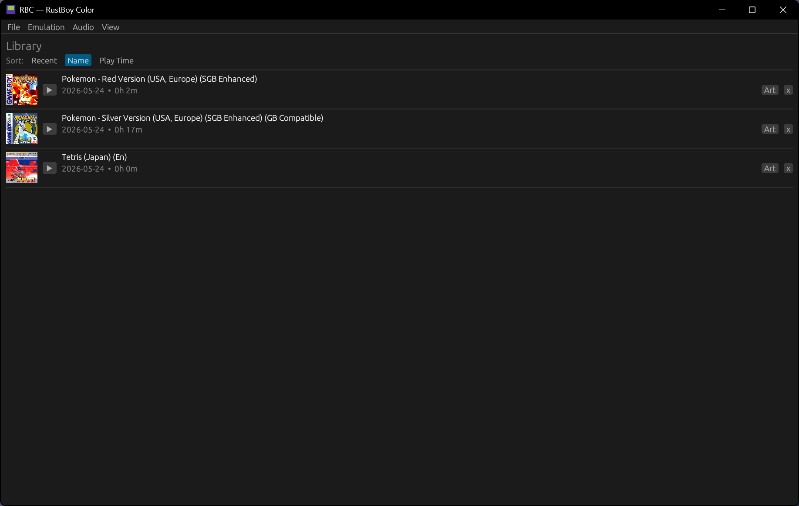
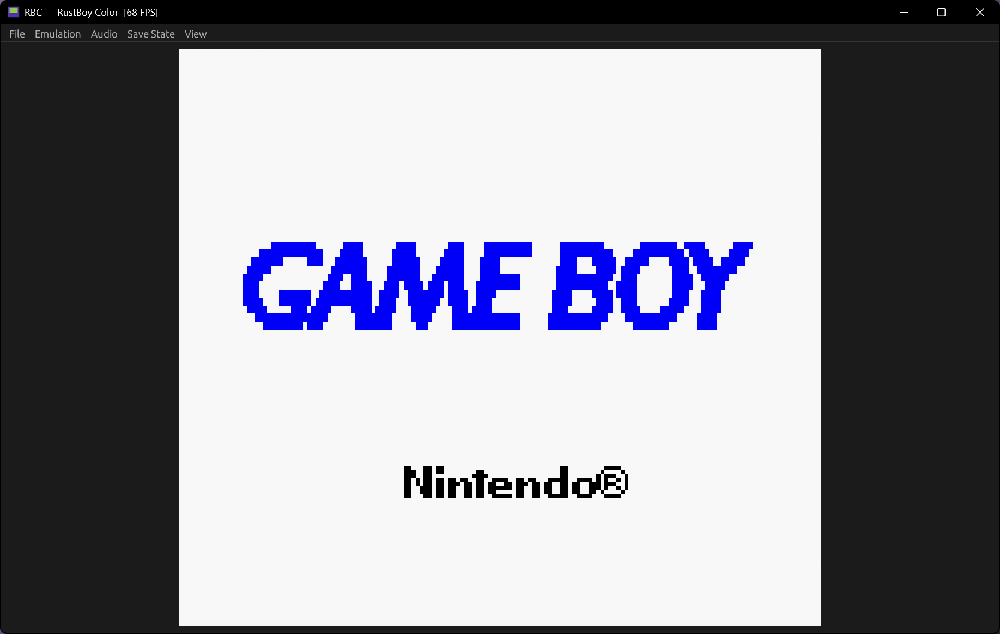
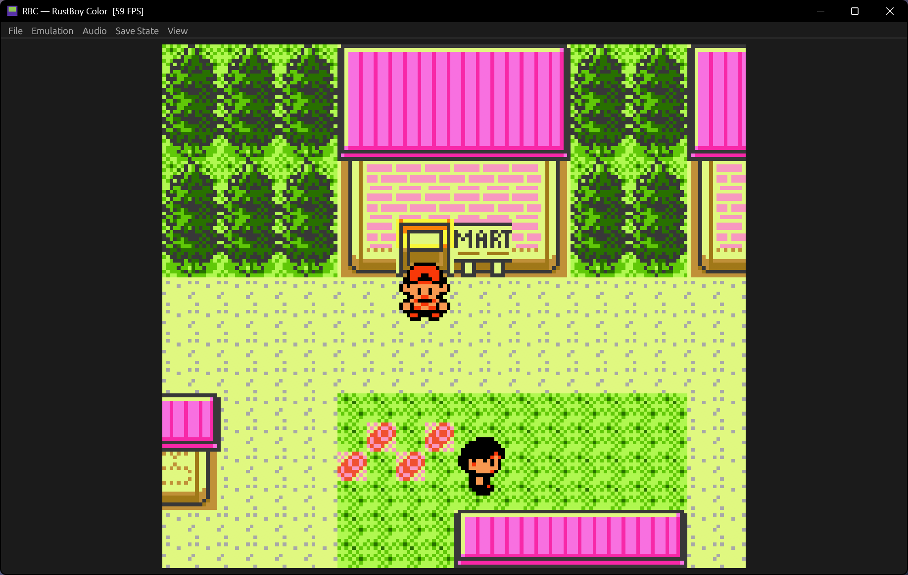
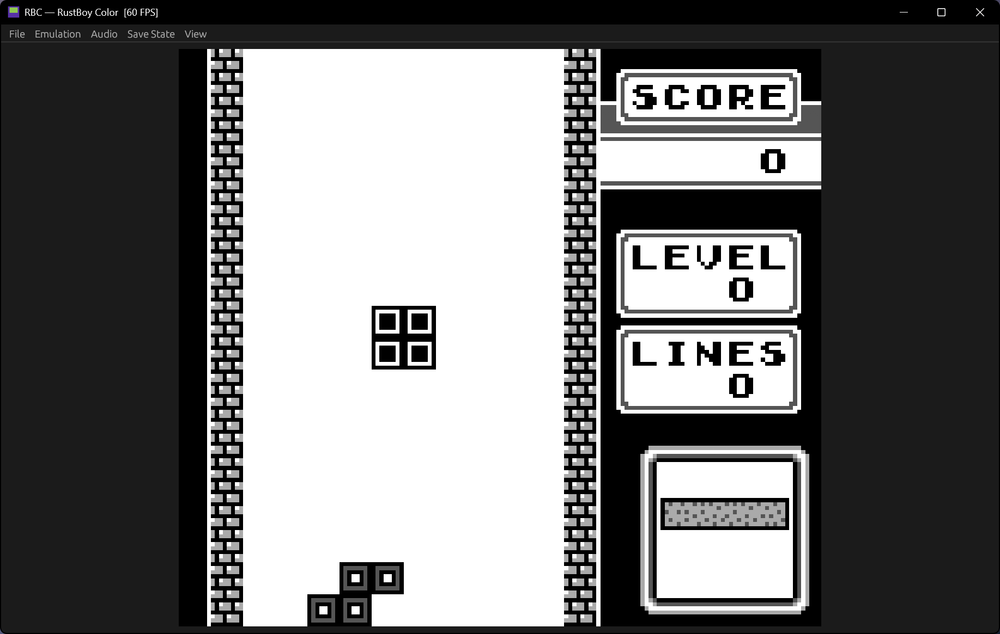

# RBC — RustBoy Color

A Game Boy Color emulator written in Rust.

[Documentation](https://deadlica.github.io/rbc/)

## Screenshots






## Usage

```
cargo run --release
```

Open a ROM via File > Open ROM, drag and drop a `.gb`/`.gbc` file onto the window, or pass it as an argument:

```
cargo run --release -- <rom.gb>
```

Place `cgb_boot.bin` in the working directory for the Nintendo logo animation on startup.

## Features

- Full SM83 CPU (all opcodes, CB prefix, interrupts, HALT, EI delay)
- PPU with background, window, and sprite rendering
- CGB color palettes, VRAM banking, tile attributes, VRAM/OAM access restrictions
- MBC1, MBC3 (with RTC), and MBC5 cartridge support
- 4-channel audio (pulse, wave, noise) with stereo output
- Double speed mode, HDMA, WRAM banking
- Boot ROM support (CGB mode during boot)
- Save files (.sav) persisted to disk

## UI

- Menu bar: File, Emulation, Audio, Save State, View
- ROM library with play time tracking, box art, and sorting
- Save states (4 slots, F1–F4 save, F5–F8 load)
- Cheats (GameShark, Game Genie, raw hex — per-game, named, persistent)
- Speed control (1x / 2x / 4x / Unlimited)
- Volume slider and mute
- Screenshot (F9)
- Fullscreen (F11)
- Dark/light theme
- Configurable keybindings
- Drag and drop ROM loading
- Export/import save files
- FPS counter
- Window size and position remembered

## Controls (default)

| Key       | Button |
|-----------|--------|
| Arrows    | D-pad  |
| Z         | A      |
| X         | B      |
| Enter     | Start  |
| Backspace | Select |

Rebind via View > Controls.

## Building

```
cargo build --release
```

Requires `libasound2-dev` on Linux for audio support.

## Tested Games

- Pokémon Red/Silver
- Tetris
- Blargg's cpu_instrs (all 11 tests pass)
